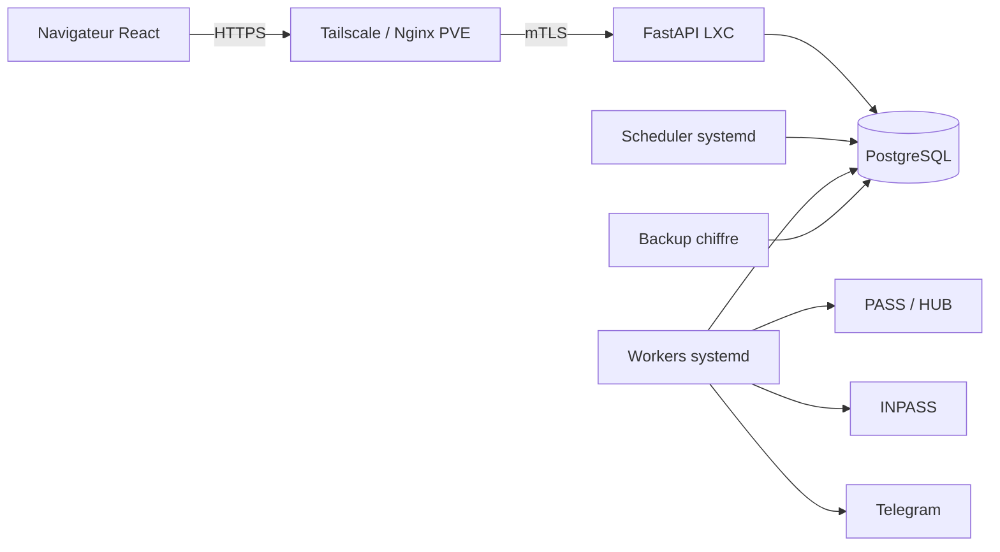

# Audit de qualite maximal

Etat verifie le 19 juillet 2026. Toutes les validations utilisent des comptes, notes, tokens, calendriers et reponses amont fictifs. Aucun appel reel a PASS, HUB, INPASS ou Telegram n'est effectue par les tests.

## 1. Architecture actuelle

IMTegrale reste sur sa stack d'origine :

- SPA React 19 et Vite 8, chargee par page ;
- API FastAPI synchrone, SQLAlchemy 2 et Alembic ;
- PostgreSQL en production, SQLite en memoire pour la suite rapide ;
- Nginx sur le PVE pour HTTPS, filtrage, quotas et proxy mTLS vers le LXC ;
- services systemd separes pour l'API, le scheduler, les workers sync/calendrier/outbox et les controles d'exploitation ;
- file PostgreSQL durable avec leases, fencing, idempotence, retries bornes, dead-letter et outbox ;
- sauvegardes PostgreSQL chiffrees et test de restauration sur hote isole.

Le frontend et l'API partagent la meme origine. FastAPI sert l'artefact `frontend/dist`. Aucun travail critique n'est lance dans un `BackgroundTask` ou un thread du processus web.

## 2. Frontieres de confiance

| Frontiere | Entree non fiable | Controles | Risque residuel |
| --- | --- | --- | --- |
| Navigateur vers API | Corps, parametres, cookies, Origin | Validation Pydantic, session serveur HttpOnly, SameSite, CSRF, Origin, autorisation serveur, limites de corps | Nouvelle route oubliee lors d'une evolution |
| Internet/LAN vers PVE | IP, en-tetes, debit | HTTPS, Tailscale, `limit_req`, `limit_conn`, en-tetes reecrits | Configuration de bordure a maintenir conforme au depot |
| PVE vers LXC | Requete proxifiee | mTLS avec CA dediee, reseau prive, proxy de confiance allowliste | Rotation des certificats a operer |
| API/workers vers PostgreSQL | Concurrence et etat durable | Transactions, FK, contraintes, Alembic, verrous et leases | Telegram reste une livraison au moins une fois |
| Workers vers PASS/HUB | HTML, JSON, cookies, redirections | Hote/origine allowlistes, tailles et delais bornes, session dediee `trust_env=False`, quotas et circuit | Contrats amont non officiels |
| Worker vers INPASS | URL privee et ICS | Validation stricte URL/DNS/redirect, tailles bornees, `trust_env=False`, cache | Evolution du format ICS |
| Worker vers Telegram | Token et contenu | Secret chiffre, client dedie sans proxy d'environnement, reponse bornee | Duplication possible apres crash post-acceptation distante |
| Administration | Identite proxy, mot de passe, WebAuthn | Entree privee, allowlist exacte, scrypt, passkey obligatoire, step-up recent, CSRF et audit | Compromission conjointe reseau + mot de passe + passkey |
| Git et release | Source, dependances, artefacts | Frontiere de contenu, SAST Ruff, scan de secrets, locks, SBOM, manifeste, smoke test | Revue humaine toujours necessaire |

## 3. Dependances et responsabilites

| Composant | Responsabilite |
| --- | --- |
| React/Vite | Rendu, navigation, cache client, accessibilite ; jamais l'autorisation |
| FastAPI | Authentification, autorisation, validation, API et orchestration durable |
| PostgreSQL/Alembic | Source de verite, contraintes, jobs, outbox, heartbeats et migrations |
| PASS/CAS | Authentification IMT et notes lors d'une action consentie |
| HUB COMPETENCES | Profil, UE, grades, semestres et ECTS officiels |
| INPASS | Calendrier individuel chiffre et rafraichi par worker |
| Telegram | Notification facultative, sans role dans l'authentification |
| Nginx/Tailscale/mTLS | Entree HTTPS, identite de bordure, quotas et isolation LXC |
| systemd | Cycle de vie, moindre privilege, restart, timers et workers |

Les services externes sont des dependances de disponibilite, pas de readiness. `/health/ready` ne les contacte jamais.

## 4. Forces constatees

- Separation multi-compte par `account_id`, testee sur les routes et les objets prives.
- Niveau d'assurance explicite : `owner` ne signifie pas automatiquement session primaire.
- Un token `owner` ne peut plus creer une passkey, un autre token `owner`, activer la synchronisation ni lancer PASS/HUB.
- Sessions et tokens stockes par HMAC, facteurs WebAuthn sans cle privee, revocation fencee par generation d'acces.
- Mots de passe IMT non conserves ; sessions PASS/HUB filtrees, chiffrees et bornees.
- Trousseau multi-cle, anciennes cles de lecture, re-encryption idempotente et rotation pepper documentee.
- Administration privee avec mot de passe, passkey et step-up de dix minutes pour les mutations sensibles.
- Jobs acceptes durables apres crash et notifications liees a la transaction metier par outbox.
- Contrat OpenAPI versionne, reponses JSON typees et client TypeScript genere avec controle de derive.
- CI SQLite + PostgreSQL + Hypothesis + Vitest/MSW + Playwright/axe + audits de release.
- Logs JSON sur liste blanche, correlation HTTP/jobs/outbox et metriques sans identite etudiante.
- Quantites academiques persistantes en `Decimal/Numeric` avec une politique `ROUND_HALF_UP` unique.

## 5. Dettes restantes

### P0

Aucune dette P0 validee n'est ouverte apres le correctif d'assurance primaire et la remediation des onze constats du scan profond.

### P1

| Dette | Condition de traitement |
| --- | --- |
| Step-up recent des actions etudiantes les plus sensibles | PR dediee avec preuve WebAuthn/IMT liee a la session, l'action et une courte expiration |
| Livraison Telegram exactement une fois impossible | Conserver l'idempotence locale et documenter la duplication rare ; ne pas promettre l'exactly-once distant |
| Contrats PASS/HUB non officiels | Maintenir fixtures positives/negatives et alerte sur erreurs amont, sans masquer les changements |

### P2

| Dette | Direction |
| --- | --- |
| `models.py`, `types.ts` et `styles.css` restent volumineux | Continuer les extractions domaine par domaine, avec tests de caracterisation et sans PR transversale |
| Metriques HTTP/SSE en memoire | Accepter le reset au redemarrage ou ajouter un exporteur seulement si un besoin d'historique est mesure |
| Couverture globale proche du plancher | Ajouter les tests avec chaque nouveau chemin ; ne jamais baisser 87,4 % lignes / 68,5 % branches |

### P3

| Dette | Mesure requise avant action |
| --- | --- |
| `LISTEN/NOTIFY` pour SSE | Connexions simultanees, latence et charge PostgreSQL du polling actuel |
| Pagination/cache du leaderboard au-dela de 1 000 participants | Population et plans SQL observes |
| Optimisation supplementaire du bundle | Web Vitals et profil d'appareils reels, sans augmenter la complexite par intuition |

## 6. Metriques finales

| Mesure | Resultat |
| --- | --- |
| Lint/SAST backend | `ruff check backend scripts` et `ruff check --select S backend/app` verts |
| Tests backend | 696 tests verts |
| Couverture backend | 87,45 % lignes, 69,20 % branches ; `calculations.py` 94,12/86,36 |
| PostgreSQL | 12 contrats CI ; migration reelle isolee `base -> 0024 -> base -> 0024` verte |
| Migration numerique | Precision/scale, arrondi des anciennes valeurs et round-trip `Decimal` testes |
| Tests frontend | 74 tests Vitest dans 17 fichiers |
| E2E/accessibilite | 25 parcours Playwright/axe verts, largeurs 320/375/768/1024/1440, clair/sombre/reduced-motion |
| Contrat API | 92 routes avec `response_model`, OpenAPI versionne, 16 fichiers client generes sans derive |
| Build frontend | 1 612 KiB sur disque, 53 fichiers |
| Budget frontend | max JS gzip 103 945 o ; max CSS gzip 32 348 o ; total gzip 411 562 o ; brotli 356 037 o |
| Audits | `pip-audit` et `pnpm audit --prod` sans vulnerabilite connue |
| Frontiere/secret scan | 225 fichiers indexes conformes ; 359 fichiers scannes sans secret detecte |
| Migrations | 24 revisions lineaires, tete `0024` |

Concentrations apres decoupage progressif :

| Avant / domaine | Apres |
| --- | --- |
| Modeles d'exploitation dans le fichier central | `models_operations.py` 119 lignes, re-export de compatibilite |
| Schemas admin et simulations dans `schemas.py` | `schemas.py` 114, `schemas_admin.py` 94, `schemas_simulations.py` 118 |
| Runtime worker dans le service jobs | `worker_runtime.py` 174 ; logique de queue conservee dans `jobs.py` |
| Types Parcours dans `types.ts` | `types/learning.ts` 211, re-export public conserve |
| Socle CSS global mele aux pages | `styles/core.css` 362, charge avant les styles applicatifs |

## 7. Lots executes

| Lot | Etat | Resultat et rollback |
| --- | --- | --- |
| P0 assurance primaire | Termine | Garde serveur `require_primary_owner(_action)`, UI derivee, code stable ; rollback applicatif sans migration |
| A contrat API | Termine | Modeles de reponse, erreur stable, OpenAPI et client genere ; artefacts regenerables |
| B qualite frontend | Termine | ESLint/Prettier, RTL/MSW, Playwright/axe, budgets et decoupage progressif |
| C tests realistes | Termine | PostgreSQL CI, Hypothesis, couverture lignes/branches non regressive |
| D durabilite | Termine | Migration `0020`, jobs/outbox/leases/workers ; downgrade possible avant utilisation productive des files |
| E securite et cles | Termine | Migration MFA `0021`, trousseau, re-encryption, SAST, secrets, SBOM et release auditee |
| F exploitation | Termine | Migration `0022`, logs/correlation/metriques/readiness/restore test et services systemd |
| G maintenabilite | Termine pour ce cycle | Migrations `0023/0024`, politique d'arrondi, index dedupliques, premieres extractions par domaine ; poursuite incrementale uniquement |

Chaque migration possede un downgrade. Le downgrade `0023` revient a `Float` mais ne peut pas recreer les decimales au-dela de la precision officielle ; la restauration bit a bit exige la sauvegarde pre-release.

## 8. Criteres d'acceptation

- [x] aucune decision d'autorisation repose uniquement sur React ;
- [x] chaine token `owner` vers passkey/token `owner` refusee avec `PRIMARY_AUTH_REQUIRED` ;
- [x] IMT et passkey primaires autorises, viewer refuse, Origin et CSRF conserves ;
- [x] aucune reponse JSON critique sans modele explicite ;
- [x] aucune derive OpenAPI/TypeScript silencieuse ;
- [x] zero violation axe serieuse ou critique sur les parcours couverts ;
- [x] parcours critiques clavier, mobile, themes et reduced-motion verts ;
- [x] contraintes, concurrence, migrations et arrondis verifies sur PostgreSQL ;
- [x] travaux acceptes durables apres crash et retries bornes ;
- [x] rotation des cles et peppers documentee et testee ;
- [x] logs, metriques et alertes expurges de donnees personnelles ;
- [x] wheel, frontend, SBOM et manifeste construits depuis les locks et smoke-testes ;
- [x] procedures de deploiement, restauration et rollback documentees.

## Risques residuels

- PASS, HUB, INPASS et Telegram restent hors du controle du projet et peuvent changer ou etre indisponibles.
- Une session passkey etudiante prouve une authentification primaire, pas encore sa recence pour chaque action sensible.
- La livraison Telegram peut etre dupliquee si le processus meurt apres acceptation distante mais avant acquittement local.
- Les scans automatiques de secrets et dependances ne remplacent pas une revue de release ni une gestion rigoureuse des secrets d'instance.
- Le prochain decoupage de gros fichiers doit rester un changement de maintenabilite isole, pas etre melange a une evolution produit.
