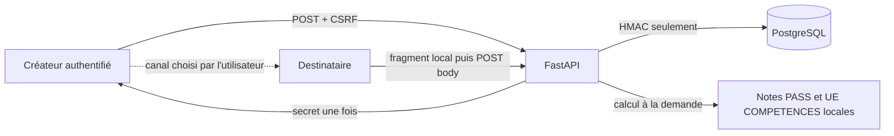

# Modèle de menace — Comparaisons privées V1

État : juillet 2026, backend Lot A et frontend Lot B non publiés, migration non
déployée et feature flag fermé. Ce document complète le
[modèle général](threat-model.md) sans modifier le consentement ni les
autorisations du leaderboard.

## Actifs et propriétés

| Actif                     | Propriété attendue                                                 |
| ------------------------- | ------------------------------------------------------------------ |
| Secret d'invitation       | 256 bits, retourné une fois, jamais stocké ou journalisé           |
| Digest d'invitation       | HMAC avec séparation de domaine, jamais exposé par l'API           |
| Consentements             | Bilatéraux, versionnés, explicites et liés à une durée             |
| Manifeste de consentement | Canonique, exhaustif et identique pour les deux participants       |
| Relation                  | Limitée à deux comptes distincts, révocable et expirante           |
| Résultats académiques     | Calculés à la demande, jamais copiés dans les nouvelles tables     |
| Identité officielle       | Visible uniquement aux deux participants actifs                    |
| Événements et métriques   | Métadonnées minimales, aucun résultat, token ou paire identifiable |

## Frontières

Le canal utilisé par le créateur pour transmettre le lien est hors de la
frontière de confiance d'IMTégrale. Le navigateur et tous les identifiants
publics sont non fiables. PostgreSQL est autoritatif pour l'état de
l'invitation et de la relation, mais un `public_id` ne prouve jamais la
participation.

## Menaces et contrôles

| Menace                                               | Impact                                                  | Contrôles V1                                                                                                                                         | Risque résiduel                                                                   |
| ---------------------------------------------------- | ------------------------------------------------------- | ---------------------------------------------------------------------------------------------------------------------------------------------------- | --------------------------------------------------------------------------------- |
| Énumération des comptes                              | Découverte d'identités ou profils                       | Aucun annuaire ni recherche ; invitation bearer ; erreurs d'éligibilité génériques                                                                   | Le créateur connaît naturellement l'identité après acceptation                    |
| Invitation transférée à un tiers                     | Mauvais participant                                     | Secret à forte entropie, comptes compatibles requis, prévisualisation et consentement explicite                                                      | Tout tiers éligible qui reçoit volontairement le secret peut l'accepter           |
| Token volé                                           | Activation non voulue                                   | TTL sept jours, usage unique, refus/révocation, HMAC seul en base, session primaire exigée                                                           | Compromission conjointe du lien et d'un compte éligible                           |
| Token dans logs ou `Referer`                         | Réutilisation du lien                                   | Fragment navigateur, effacement avec `replaceState` avant preview, body POST, `no-referrer`, validation sans echo, événements allowlistés            | Le canal de partage tiers peut conserver le lien                                  |
| Token dans l'état ou les caches frontend             | Exposition après le flux ou via outils de développement | Référence mémoire éphémère, appels directs du client généré, aucune query/mutation TanStack, aucun storage, `history.state`, titre, toast ou console | Une extension de navigateur compromise peut lire une page ouverte                 |
| Double effet React StrictMode                        | Preview ou acceptation répétée                          | Capture unique du fragment, garde de montage et appels utilisateur ponctuels ; tests StrictMode                                                      | Un changement futur du cycle de montage doit conserver ces tests                  |
| Token réutilisé                                      | Relations multiples                                     | Verrou `FOR UPDATE`, état consommé atomique, digest unique                                                                                           | Aucun après commit hors restauration d'une ancienne base                          |
| Double acceptation simultanée                        | Deux relations ou destinataires                         | Verrou invitation, comptes verrouillés dans l'ordre canonique, paire unique, tests PostgreSQL                                                        | Blocage transitoire possible sous forte concurrence                               |
| Auto-invitation                                      | Contournement du consentement bilatéral                 | IDs distincts obligatoires, refus générique avant création relationnelle                                                                             | Aucun connu                                                                       |
| Promotions ou cursus incompatibles                   | Comparaison hors périmètre                              | Segment exact des deux comptes à l'acceptation et à chaque détail                                                                                    | Une erreur de classification amont reste possible                                 |
| Viewer ou token `owner`                              | Accès délégué à des notes croisées                      | `require_primary_owner`/`action`, auth IMT ou passkey, aucun `share_token_id`                                                                        | Vol d'une session primaire active                                                 |
| Administrateur lisant une comparaison                | Accès privilégié indu                                   | Les sessions admin ne sont pas des sessions étudiantes ; aucune route admin de détail                                                                | Root/PostgreSQL peut toujours lire les tables académiques sources                 |
| Accès direct par `public_id` / IDOR                  | Lecture d'une autre paire                               | ID opaque et filtre participant côté serveur ; erreur identique absent/non autorisé                                                                  | Bug futur si une route omet le filtre                                             |
| Révocation pendant une lecture                       | Réponse après retrait                                   | Verrou partagé de la relation pendant le calcul ; révocation exclusive ; aucune lecture commencée après commit                                       | Une réponse déjà reçue ne peut pas être rappelée                                  |
| Expiration pendant une lecture                       | Données après échéance                                  | Vérification sous verrou au début ; expiration à chaque nouvelle lecture                                                                             | Une réponse commencée juste avant l'échéance peut finir                           |
| Compte désactivé ou supprimé                         | Accès persistant                                        | Auth refuse le compte désactivé ; paire revalidée ; FK cascade à la suppression                                                                      | Les copies réalisées avant suppression subsistent chez l'autre participant        |
| Changement de cursus/promotion                       | Ancienne relation devenue incompatible                  | Éligibilité revalidée à chaque détail et statut non actif dans la liste                                                                              | Fenêtre jusqu'à la mise à jour locale des attributs officiels                     |
| Ancien lien après révocation                         | Réactivation involontaire                               | Consentement créateur strictement postérieur à la borne terminale sous verrou ; invitation obsolète terminalisée ; nouveau `public_id`               | Restauration d'une sauvegarde exige une procédure de révocation                   |
| Relation existante et nouvelle invitation            | Relations parallèles                                    | Une paire canonique unique ; invitation obsolète terminalisée ; seule une invitation postérieure au cycle peut réactiver                             | Une invitation transférée reste une capacité jusqu'à son usage ou sa terminaison  |
| Fuite dans événements/métriques                      | Données académiques secondaires                         | Événements sans score, UE, token, digest ou autre compte ; métriques agrégées                                                                        | Un volume très faible peut révéler une utilisation générale à l'opérateur         |
| Fuite dans traces SQL                                | Secret ou résultat                                      | Paramètres liés ; aucun token brut en base ; logs SQL désactivés en production                                                                       | Un opérateur activant un tracing de bodies pourrait violer la politique           |
| Cache navigateur/proxy                               | Réponse servie après révocation                         | `private, no-store`, `Pragma: no-cache`, `Vary: Cookie`, aucun service worker                                                                        | Le navigateur peut garder une page déjà affichée en mémoire                       |
| Cache React après révocation ou changement de compte | Affichage croisé devenu non autorisé                    | Clés bornées par compte, `gcTime=0`, retrait au démontage, `404`, révocation, déconnexion et changement de capacité                                  | Une donnée déjà lue reste mémorisable par le participant                          |
| Copy de consentement incomplète                      | Divulgation non comprise par un participant             | Manifeste V2 backend unique, champs inclus et catégories exclues explicites, création et acceptation bloquées si le manifeste manque ou diverge      | Un participant peut ne pas lire intégralement un texte pourtant accessible        |
| Nouveau champ sans nouveau consentement              | Extension silencieuse du périmètre                      | Test structurel entre le modèle de détail et les chemins du manifeste ; changement de périmètre soumis à une nouvelle version de consentement        | Une revue humaine reste nécessaire pour vérifier la qualité de la formulation     |
| Token dans trace, vidéo ou capture                   | Secret durable dans un artefact de test                 | Fixtures synthétiques aléatoires, trace/vidéo/capture désactivées pour les flux E2E one-shot                                                         | Une capture manuelle explicite du lien reste hors contrôle du produit             |
| Capture volontaire                                   | Diffusion hors produit                                  | Copy de consentement explicite et périmètre minimal                                                                                                  | Impossible à empêcher : un participant autorisé peut recopier ou capturer l'écran |

## Concurrence et atomicité

L'acceptation verrouille d'abord l'invitation, puis les deux comptes triés par
UUID, puis la relation canonique. La consommation et l'activation sont dans le
même commit. Une révocation repère la relation, verrouille les comptes dans le
même ordre canonique, puis relit et verrouille la relation. Un détail repère la
relation, verrouille en lecture les comptes dans l'ordre canonique, puis relit
et verrouille la relation avant de calculer les données officielles. Cet ordre
évite un cycle avec l'acceptation tout en stabilisant l'éligibilité. Une
suppression administrative verrouille d'abord les invitations liées afin de
conserver l'ordre invitation-compte de l'acceptation avant les cascades SQL.
Une expiration est logique et ne dépend pas d'un nettoyage asynchrone.

Scénarios testés : double acceptation du même secret, invitations obsolète et
fraîche concurrentes, deux invitations fraîches concurrentes, acceptation et
révocation simultanées, révocation immédiate, lecture tierce, relation expirée,
invitation révoquée/expirée/consommée, auto-invitation, incompatibilité
académique, suppression en cascade et changement de promotion. PostgreSQL
vérifie les vrais verrous et contraintes ; SQLite vérifie migration et
invariants de schéma.

## Données autorisées et minimisation

Les tables `private_comparison_invitations` et `private_comparisons` ne
contiennent aucune note, moyenne, UE, GPA, ECTS, identité ou simulation. Le
service charge uniquement les notes `source=pass` non archivées et les UE
`metadata_source=competences`, réutilise les calculs backend existants et ne
retient que les codes officiels uniques présents des deux côtés. Il ne déclenche
aucun appel réseau.

Les valeurs manuelles, simulations, détails d'évaluation, contenus Parcours et
données du leaderboard sont absents du contrat V1. Une ambiguïté de code
officiel du même côté retire l'UE de l'intersection au lieu d'effectuer un
rapprochement flou.

Le manifeste de consentement V2 décrit chaque champ sérialisable du détail et
les catégories explicitement exclues. Il est construit une seule fois dans le
contrat backend, exposé par une route `no-store`, repris à l'identique dans la
création et la preview, puis rendu dynamiquement dans les deux parcours. La
version V1 est refusée par Pydantic, le service et les contraintes de la
migration `0029`.

Le client n'utilise la capacité de session que pour la visibilité et le
routage. Une route masquée n'est jamais considérée comme autorisée : chaque
lecture et mutation conserve les contrôles backend de participant, session
primaire, Origin, CSRF et feature flag. Le titre du document ne reçoit
l'identité de l'autre participant qu'après chargement autorisé de la relation ;
il ne contient jamais de token, identifiant public ou résultat académique.

## Hypothèses et risques acceptés

- le pepper HMAC reste hors PostgreSQL et suit la rotation existante ;
- le proxy ne journalise pas les bodies et conserve `Referrer-Policy` ;
- les comptes, profils et sources académiques officiels sont correctement
  classifiés ;
- le participant choisit un canal de partage approprié ;
- un participant autorisé peut toujours mémoriser, recopier, photographier ou
  rediffuser les données affichées ; la révocation ne peut pas effacer ces
  copies ;
- une compromission root ou applicative complète dépasse la séparation logique
  entre deux comptes et doit être traitée comme incident d'instance.

Une V2 exposant des évaluations détaillées est hors périmètre. Elle exige une
nouvelle version de consentement, une analyse de minimisation et une revue de ce
modèle avant tout code.
