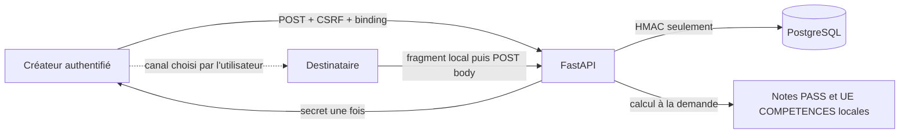

# Modèle de menace — Comparaisons privées V1

État : juillet 2026, backend Lot A, frontend Lot B et remédiations C6A/C6B non
publiés, migration non déployée et feature flag fermé. Ce document complète le
[modèle général](threat-model.md) sans modifier le consentement ni les
autorisations du leaderboard.

## Actifs et propriétés

| Actif                     | Propriété attendue                                                 |
| ------------------------- | ------------------------------------------------------------------ |
| Secret d'invitation       | 256 bits, retourné une fois, jamais stocké ou journalisé           |
| Digest d'invitation       | HMAC avec séparation de domaine, jamais exposé par l'API           |
| Consentements             | Bilatéraux, V3, actor-specific, liés au digest exact et à une durée |
| Manifeste de consentement | Canonique par rôle ; périmètre commun, direction d'identité exacte |
| Génération d'éligibilité  | Monotone, transactionnelle, capturée pour chaque participant       |
| Relation                  | Deux comptes, quatre états explicites, terminaison irréversible     |
| Résultats académiques     | Calculés à la demande, jamais copiés dans les nouvelles tables     |
| Identité officielle       | Visible uniquement aux deux participants actifs                    |
| Événements et métriques   | Classe immuable, rétention isolée, aucun résultat, token ou paire  |
| Autorité navigateur       | Document-scoped, monotone, writer unique de la session              |
| Binding de mutation       | Opaque, lié à la WebSession fraîche, jamais une authentification    |

## Frontières

Le canal utilisé par le créateur pour transmettre le lien est hors de la
frontière de confiance d'IMTégrale. Le navigateur et tous les identifiants
publics sont non fiables. PostgreSQL est autoritatif pour l'état de
l'invitation et de la relation, mais un `public_id` ne prouve jamais la
participation.

Le bootstrap navigateur possède le fragment avant le routeur. L'autorité de
session se trouve au-dessus du QueryClient d'époque, lui-même au-dessus du
routeur. PostgreSQL reste la seule autorité de session et de mutation :
l'`auth_epoch` n'est jamais envoyé au serveur, tandis que le
`X-IMTEGRALE-SESSION-BINDING` est seulement une attente opaque à comparer à la
session fraîche.

## Menaces et contrôles

| Menace                                               | Impact                                                  | Contrôles V1                                                                                                                                         | Risque résiduel                                                                   |
| ---------------------------------------------------- | ------------------------------------------------------- | ---------------------------------------------------------------------------------------------------------------------------------------------------- | --------------------------------------------------------------------------------- |
| Énumération des comptes                              | Découverte d'identités ou profils                       | Aucun annuaire ni recherche ; invitation bearer ; erreurs d'éligibilité génériques                                                                   | Le créateur connaît naturellement l'identité après acceptation                    |
| Invitation transférée à un tiers                     | Mauvais participant                                     | Secret à forte entropie, comptes compatibles requis, prévisualisation et consentement explicite                                                      | Tout tiers éligible qui reçoit volontairement le secret peut l'accepter           |
| Token volé                                           | Activation non voulue                                   | TTL sept jours, usage unique, refus/révocation, HMAC seul en base, session primaire exigée                                                           | Compromission conjointe du lien et d'un compte éligible                           |
| Token dans logs ou `Referer`                         | Réutilisation du lien                                   | Propriétaire de fragment au bootstrap, scrub avant route gate/session/render, body POST, `no-referrer`, validation sans echo, événements allowlistés | Le canal de partage tiers peut conserver le lien                                  |
| Token dans l'état ou les caches frontend             | Exposition après le flux ou via outils de développement | Mémoire volatile one-shot liée à l'époque et au scope ; aucun query/mutation TanStack, storage, `history.state`, titre, toast ou console               | Une extension de navigateur compromise peut lire une page ouverte                 |
| Remplacement direct de compte ou BFCache             | Le nouveau principal récupère le bearer ou les données A | Autorité document-scoped, nouvel `auth_epoch`, ancien QueryClient détruit, barrière DOM synchrone, purge à `pagehide`, revalidation au `pageshow`      | Un lien déjà copié volontairement dans le presse-papiers reste hors du contrôle de l'application |
| Réponse de session hors ordre                        | Résurrection du principal ou de la capacité précédente  | Writer unique, séquence croissante, époque capturée, abort et vérification de la dernière requête avant publication                                  | Une panne réseau peut maintenir l'interface fermée                                |
| Réponse retardée réancrant l'expiration              | Confiance locale prolongée au-delà de la session         | RTT intégral soustrait ; même scope seulement raccourcissable ; heure serveur régressive et métadonnées invalides refusées                            | Une nouvelle WebSession légitime crée volontairement un nouveau scope             |
| Double effet React StrictMode                        | Preview ou acceptation répétée                          | Capture unique du fragment, garde de montage et appels utilisateur ponctuels ; tests StrictMode                                                      | Un changement futur du cycle de montage doit conserver ces tests                  |
| Token réutilisé                                      | Relations multiples                                     | Verrou `FOR UPDATE`, état consommé atomique, digest unique                                                                                           | Aucun après commit hors restauration d'une ancienne base                          |
| Double acceptation simultanée                        | Deux relations ou destinataires                         | Verrou invitation, comptes verrouillés dans l'ordre canonique, paire unique, tests PostgreSQL                                                        | Blocage transitoire possible sous forte concurrence                               |
| Auto-invitation                                      | Contournement du consentement bilatéral                 | IDs distincts obligatoires, refus générique avant création relationnelle                                                                             | Aucun connu                                                                       |
| Promotions ou cursus incompatibles                   | Comparaison hors périmètre                              | Segment exact des deux comptes à l'acceptation et à chaque détail                                                                                    | Une erreur de classification amont reste possible                                 |
| Viewer ou token `owner`                              | Accès délégué à des notes croisées                      | `require_primary_owner`/`action`, auth IMT ou passkey, aucun `share_token_id`                                                                        | Vol d'une session primaire active                                                 |
| Preflight A puis POST sous B                         | Mutation durable sous un autre principal                | Header de binding obligatoire sur chaque opération sensible ; mismatch générique avant tout effet                                                    | Aucun connu sans compromission de la session B et du serveur                      |
| Session révoquée pendant l'attente des verrous       | Écriture après révocation                               | `WebSession` et compte relus avec `populate_existing`/`FOR UPDATE` au début puis validés juste avant le premier effet                                  | La transaction qui gagne le verrou définit le point de linéarisation              |
| Administrateur lisant une comparaison                | Accès privilégié indu                                   | Les sessions admin ne sont pas des sessions étudiantes ; aucune route admin de détail                                                                | Root/PostgreSQL peut toujours lire les tables académiques sources                 |
| Accès direct par `public_id` / IDOR                  | Lecture d'une autre paire                               | ID opaque et filtre participant côté serveur ; erreur identique absent/non autorisé                                                                  | Bug futur si une route omet le filtre                                             |
| Révocation pendant une lecture                       | Réponse après retrait                                   | Verrou partagé de la relation pendant le calcul ; révocation exclusive ; aucune lecture commencée après commit                                       | Une réponse déjà reçue ne peut pas être rappelée                                  |
| Expiration pendant une lecture                       | Données après échéance                                  | Vérification sous verrou au début ; expiration à chaque nouvelle lecture                                                                             | Une réponse commencée juste avant l'échéance peut finir                           |
| Compte désactivé ou supprimé                         | Accès persistant                                        | Génération avancée et relation terminalisée ; suppression sous verrous canoniques, puis cascade avec seul événement minimal conservé chez le pair      | Les copies réalisées avant suppression subsistent chez l'autre participant        |
| Changement de cursus, promotion, identité ou source  | Réactivation d'un ancien consentement                    | Génération monotone par compte, valeurs capturées à l'activation, mismatch persisté en `eligibility_changed`, nouvel aller-retour = nouvelle génération | Fenêtre jusqu'à la mise à jour locale des attributs officiels                     |
| Indisponibilité technique temporaire                 | Fausse révocation ou fuite de la cause                   | État `suspended` distinct, réponse minimale sans identité/résultat/cause ; reprise seulement si générations et consentements sont inchangés            | Le participant apprend seulement qu'une lecture est temporairement indisponible   |
| Ancien lien après révocation                         | Réactivation involontaire                               | Consentement créateur strictement postérieur à la borne terminale sous verrou ; invitation obsolète terminalisée ; nouveau `public_id`               | Restauration d'une sauvegarde exige une procédure de révocation                   |
| Relation existante et nouvelle invitation            | Relations parallèles                                    | Une paire canonique unique ; invitation obsolète terminalisée ; seule une invitation postérieure au cycle peut réactiver                             | Une invitation transférée reste une capacité jusqu'à son usage ou sa terminaison  |
| Fuite dans événements/métriques                      | Données académiques secondaires                         | Événements sans score, UE, token, digest ou autre compte ; métriques agrégées                                                                        | Un volume très faible peut révéler une utilisation générale à l'opérateur         |
| Token `owner` observant les événements privés        | Déduction d'une invitation ou relation                  | `private_comparison:` classé `primary_owner`; filtre SQL commun au dashboard/polling/SSE, au dernier curseur visible et au rendu                      | L'opérateur conserve les seuls agrégats opérationnels explicitement autorisés     |
| Événement privé évinçant une ancre visible           | Oracle de volume par curseur, pagination ou reconnexion | Quota indépendant par `(account_id, visibility_class)`, verrou compte avant pruning, suppression bornée à la classe de l'événement                    | Une activité visible peut normalement expirer une ancre de sa propre classe       |
| Type d'événement futur non classé                    | Divulgation accidentelle à un rôle trop large           | Classification centrale exhaustive ; write runtime refusé ; backfill historique inconnu vers `primary_owner`; classe immuable ORM et base             | Tout nouveau préfixe exige une décision explicite et des tests                    |
| Fuite dans traces SQL                                | Secret ou résultat                                      | Paramètres liés ; aucun token brut en base ; logs SQL désactivés en production                                                                       | Un opérateur activant un tracing de bodies pourrait violer la politique           |
| Cache navigateur/proxy                               | Réponse servie après révocation                         | `private, no-store`, `Pragma: no-cache`, `Vary: Cookie`, aucun service worker                                                                        | Le navigateur peut garder une page déjà affichée en mémoire                       |
| Cache React après révocation ou changement de compte | Affichage croisé devenu non autorisé                    | QueryClient par époque, lease explicite, blocage synchrone, observer désactivé avant purge, `gcTime=0`, signal terminal aux deux participants          | Une donnée déjà lue reste mémorisable par le participant                          |
| Ordres de verrous divergents                         | Deadlock ou écriture partielle                           | Plan total `WebSession → comptes triés → invitation → relation`, y compris transitions de compte et tests PostgreSQL concurrents                     | Attente bornée possible sous contention légitime                                 |
| Copy de consentement dans le mauvais sens            | Divulgation non comprise par un participant             | Manifestes V3 backend distincts `creator`/`acceptor`, direction et moment explicites, frontend sans copy parallèle, tests DOM/labels par rôle          | Un participant peut ne pas lire intégralement un texte pourtant accessible        |
| Manifeste affiché différent du consentement stocké   | Preuve de consentement ambiguë                           | SHA-256 JSON canonique lié à la version, au rôle et à tous les textes ; comparaison constant-time ; deux digests et compte créateur persistés          | Une revue humaine reste nécessaire pour juger la clarté du texte                  |
| Nouveau champ sans nouveau consentement              | Extension silencieuse du périmètre                      | Test structurel entre le modèle de détail et les chemins du manifeste ; changement de périmètre soumis à une nouvelle version de consentement        | Une revue humaine reste nécessaire pour vérifier la qualité de la formulation     |
| Token dans trace, vidéo ou capture                   | Secret durable dans un artefact de test                 | Fixtures synthétiques aléatoires, trace/vidéo/capture désactivées pour les flux E2E one-shot                                                         | Une capture manuelle explicite du lien reste hors contrôle du produit             |
| Capture volontaire                                   | Diffusion hors produit                                  | Copy de consentement explicite et périmètre minimal                                                                                                  | Impossible à empêcher : un participant autorisé peut recopier ou capturer l'écran |

## Concurrence et atomicité

Le plan total unique est :

1. `WebSession` courante pour une mutation ;
2. comptes participants triés par UUID canonique ;
3. invitation ;
4. relation ;
5. lignes dépendantes éventuelles.

L'acceptation lit d'abord des coordonnées non autoritatives, puis prend la
session et les comptes, relit/verrouille l'invitation et enfin la relation. La
consommation et l'activation sont dans le même commit. Révocations et refus
suivent le même ordre. Détail et listing n'ont pas besoin de verrouiller une
session, mais prennent les comptes puis les relations. Les transitions
administratives qui désactivent, révoquent ou suppriment un compte verrouillent
toutes ses `WebSession` dans l'ordre avant le compte et les invitations.

Chaque mutation effectue un preflight court, le libère, puis reconstruit son
plan final. Sous ce plan, elle relit la `WebSession` et les comptes avec
`populate_existing=True` et `FOR UPDATE`, vérifie le binding en temps constant,
puis répète la validation immédiatement avant le premier token, digest,
consentement, relation ou événement durable. Une instance ORM chargée avant un
commit concurrent n'est jamais une preuve d'autorisation.

Scénarios testés : double acceptation du même secret, invitations obsolète et
fraîche concurrentes, deux invitations fraîches concurrentes, acceptation et
révocation simultanées, liste/détail contre révocation, session révoquée contre
acceptation, changement sémantique contre acceptation, deux changements
sémantiques simultanés sans lost update, compte désactivé, ordre inverse
artificiel, rollback, révocation immédiate, lecture tierce, relation expirée,
invitation révoquée/expirée/consommée, trois cycles, suspension/récupération,
suppression en cascade et pruning concurrent par classe. PostgreSQL vérifie les
vrais verrous, triggers, timeouts et contraintes ; SQLite vérifie migration et
invariants de schéma.

## Données autorisées et minimisation

Les tables `private_comparison_invitations` et `private_comparisons` ne
contiennent aucune note, moyenne, UE, GPA, ECTS, identité ou simulation. Le
service charge uniquement les notes `source=pass` non archivées et les UE
`metadata_source=competences`, réutilise les calculs backend existants et ne
retient que les codes officiels uniques présents des deux côtés. Il ne déclenche
aucun appel réseau.

Les valeurs manuelles, simulations, détails d'évaluation, contenus Parcours et
données du leaderboard sont absents du contrat V1. Une ambiguïté de code
officiel du même côté retire l'UE de l'intersection au lieu d'effectuer un
rapprochement flou.

Les deux manifestes de consentement V3 décrivent chaque champ sérialisable du
détail et les catégories explicitement exclues. Ils sont construits dans le
contrat backend, exposés par une route `no-store` actor-specific, puis rendus
dynamiquement dans le parcours correspondant. Leur SHA-256 canonique est soumis
avec la mutation et conservé comme preuve minimale. Les versions 1, 2 et futures
sont refusées par Pydantic, le service et les contraintes de la migration
`0029`.

Le client n'utilise la capacité de session que pour la visibilité et le
routage. Une route masquée n'est jamais considérée comme autorisée : chaque
lecture conserve les contrôles backend de participant, session primaire et
feature flag ; chaque mutation ajoute Origin, CSRF et binding. Le serveur
dérive en outre un scope
opaque propre à la session web ; il ne révèle ni identifiant de session ni
secret, mais varie avec le compte, la méthode d'authentification, le rôle, la
délégation, la génération d'accès et la capacité Comparaisons. Le bearer
one-shot n'est rendu que sous son scope créateur et toute réponse arrivée après
un changement de scope est jetée. Le titre du document reste toujours
« Comparaison privée · IMTégrale » et ne contient aucune identité.

Cette liaison est appliquée par `SessionAuthority`, frontière racine à états
`verifying`, `verified`, `invalidating`, `expired` et `anonymous`. Elle possède
seule le droit de publier la session ; `useSession` n'est qu'une projection
read-only dans le QueryClient de l'époque. Le serveur expose l'expiration et
son heure courante ; le client soustrait le RTT complet, ancre la durée sur
l'horloge monotone et conserve une borne murale. Seul `verified` rend le
sous-arbre sensible.

Les signaux inter-onglets, le passage offline, l'expiration, `pagehide` et le
BFCache retirent le DOM avant tout travail asynchrone, abortent les opérations,
détruisent l'ancien QueryClient et purgent caches et bearers. Après un retour
BFCache, une revalidation `no-store` précède tout nouveau rendu ou fetch. Les
événements `private_comparison:revoked|expired` transportent seulement le
`public_id` opaque ; le client bloque le lease et vide le cache avant tout
refetch.

Une relation terminée n'est jamais rejointe à un compte vivant. Son modèle
d'historique expose uniquement l'identifiant relationnel opaque, le statut
terminal et la date de fin ; il ne conserve ni identité, ni fraîcheur, ni
résultat, ni snapshot personnel.

Les événements de cycle de vie sont soumis à une assurance distincte des
événements historiquement visibles par un rôle `owner`. Une fonction centrale
classe chaque famille en `shared`, `owner`, `primary_owner` ou `simulation`
avant l'écriture,
et la classe stockée est immuable. Le serveur applique une seule politique SQL
à la sélection, au `latest_event_cursor`, au dashboard, au polling et au SSE.
Les IDs ordonnés ne quittent pas le serveur ; un curseur aléatoire de 192 bits
est résolu avec le compte et cette même politique.

La rétention conserve 2 000 événements par compte **et par classe**. Le pruning
ne peut supprimer que des lignes de la classe courante. Un token délégué ne
peut donc ni lire un événement Comparaisons, ni observer un trou de séquence,
une ancre disparue ou une pagination modifiée par son volume. Les classes sont :

- `shared` : calendrier, notes, UE, sync, accès/session PASS, passkeys,
  configuration de sécurité et credentials de sync ;
- `owner` : compte, authentification, leaderboard, Learning, Telegram et
  tokens ;
- `primary_owner` : Comparaisons et tout événement historique inconnu ;
- `simulation` : simulations, isolées pour préserver les exports qui les
  excluent sans partager leur quota avec Comparaisons. Un write futur inconnu
  reste refusé.

## Hypothèses et risques acceptés

- le pepper HMAC reste hors PostgreSQL et suit la rotation existante ;
- le proxy ne journalise pas les bodies et conserve `Referrer-Policy` ;
- les comptes, profils et sources académiques officiels sont correctement
  classifiés ;
- le participant choisit un canal de partage approprié ;
- un participant autorisé peut toujours mémoriser, recopier, photographier ou
  rediffuser les données affichées ; la révocation ne peut pas effacer ces
  copies ;
- une compromission root ou applicative complète dépasse la séparation logique
  entre deux comptes et doit être traitée comme incident d'instance.

Une future version exposant des évaluations détaillées est hors périmètre. Elle exige une
nouvelle version de consentement, une analyse de minimisation et une revue de ce
modèle avant tout code.

## Périmètre restant après C6B

C6A ferme l'autorité de session, le fragment, les réponses hors ordre, la
deadline, le binding/rebind, l'ordre des verrous et la purge terminale. C6B
ajoute la génération d'éligibilité, les états
`active`/`suspended`/`revoked`/`expired`, le consentement V3 actor-specific lié
au digest exact et la rétention événementielle par classe sans oracle.

Les constats ZIP, formats binaires reconnus par magic, exemption Telegram
contextuelle et snapshot de release mutable appartiennent exclusivement à C6C.
Le feature flag reste faux, `0029` reste non déployée et aucun nouveau scan
indépendant n'est requis avant la fin de C6C.
