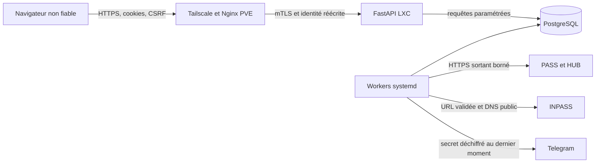

# Modèle de menace

État de référence : juillet 2026. Ce document décrit l'instance IMTégrale standard et doit être relu lors de toute modification d'authentification, de synchronisation, de proxy ou de stockage secret.

## Objectifs de sécurité

Les invariants prioritaires sont les suivants :

1. un compte ne peut jamais lire ou modifier les données académiques d'un autre compte ;
2. une délégation `viewer` ne peut pas devenir propriétaire et un token `owner` ne peut pas créer un facteur primaire ;
3. un secret PASS, HUB, INPASS ou Telegram n'est ni publié, ni journalisé, ni renvoyé par l'API ;
4. les opérations mutatives exigent l'autorisation serveur, l'Origin attendu et le CSRF ;
5. une tâche acceptée est durable, bornée et ne contourne pas les quotas PASS après un crash ;
6. l'administration est inaccessible depuis l'entrée Internet et exige réseau privé, mot de passe et passkey ;
7. une sauvegarde ou un artefact de release ne doit pas rendre les secrets plus accessibles que l'instance active.

## Actifs

| Actif | Sensibilité | Propriété attendue |
| --- | --- | --- |
| Notes, UE, GPA, identité et calendrier | Données personnelles académiques | Confidentialité par `account_id`, intégrité des sources officielles |
| Cookies PASS/HUB et URL INPASS | Capacités d'accès temporaires | Chiffrement contextuel, durée bornée, révocation |
| Token Telegram et Chat ID | Secret et destination externe | Chiffrement, aucun affichage après saisie |
| Sessions, CSRF, tokens partagés | Capacités IMTégrale | HMAC, expiration, génération d'accès et révocation |
| Passkeys étudiant et admin | Facteurs persistants | Clé publique seulement, challenge unique lié à la session, vérification utilisateur |
| Clés AES, peppers, certificats mTLS | Secrets d'infrastructure | Hors Git, permissions minimales, rotation contrôlée |
| Jobs, outbox et audits | État opérationnel | Atomicité, idempotence, expurgation et rétention |

## Acteurs

- étudiant authentifié par IMT ou passkey ;
- détenteur légitime ou compromis d'un token partagé `viewer` ou `owner` ;
- client Internet non authentifié ;
- autre compte IMT légitime tentant un accès croisé ;
- administrateur de l'instance depuis l'identité réseau explicitement autorisée ;
- service externe compromis ou malformé : PASS, HUB, INPASS ou Telegram ;
- attaquant ayant obtenu PostgreSQL sans la clé AES, ou la clé sans la base ;
- attaquant ayant compromis simultanément le processus applicatif et ses secrets, considéré hors capacité de confinement applicative complète.

## Frontières et flux

Le navigateur, les en-têtes entrants, les documents externes et toutes les réponses amont sont non fiables. Seul Nginx peut produire `X-BotNote-Client-Identity`, et FastAPI ne le lit que lorsque le pair TCP appartient à `BOTNOTE_TRUSTED_PROXY_IPS`.

## Chemins d'abus et contrôles

| Chemin source vers sink | Impact visé | Contrôles obligatoires | Risque résiduel |
| --- | --- | --- | --- |
| Cookie d'un compte A vers requête d'un objet B | Séparation multi-compte | Filtre `account_id` dérivé de la session sur chaque lecture/mutation, FK et tests croisés | Erreur future d'autorisation dans une nouvelle route |
| Token `owner` vers passkey ou token `owner` | Persistance après révocation | `require_primary_owner_action`, `auth_method` primaire, absence de `share_token_id`, CSRF/Origin | Un token `owner` peut volontairement créer un `viewer`, visible et révocable |
| Challenge WebAuthn rejoué ou croisé | Création/usage de facteur indu | Expiration cinq minutes, suppression atomique, liaison compte et session, RP ID, Origin et user verification | Compromission de l'appareil authentificateur |
| URL calendrier contrôlée vers client HTTP | SSRF et fuite de secret | Hôte, port, chemin et paramètres stricts, résolution publique, redirections validées, `trust_env=False`, taille bornée | Changement de comportement du service autorisé |
| Réponse PASS/HUB vers parseur et base | Injection, corruption, déni de service | Origines et redirections strictes, limites de taille/temps, parseurs bornés, validation et transactions | Évolution non annoncée du HTML ou JSON amont |
| Secret chiffré en base vers mauvais compte | Déchiffrement croisé | AES-256-GCM et AAD lié au type et à l'identifiant immuable | Compromission conjointe base et trousseau |
| Identité ou mot de passe admin vers action destructive | Prise de contrôle administrative | Entrée privée, allowlist exacte, scrypt, CSRF/Origin, passkey obligatoire, step-up dix minutes, audit | Compromission conjointe appareil Tailnet, mot de passe et passkey |
| Crash worker entre effet et acquittement | Perte ou duplication | Jobs PostgreSQL, lease/fencing, idempotence, retries bornés, outbox transactionnelle | Telegram reste au moins une fois et peut dupliquer après acceptation distante |
| Source ou build vers GitHub/release | Publication d'un secret ou contenu privé | scanner de secrets, contrôle de frontière, SAST Ruff, SBOM, manifeste haché et smoke du wheel/front construit | Les détecteurs par motifs ne remplacent pas une revue humaine |

## Hypothèses d'exploitation

- PostgreSQL, les fichiers d'environnement, les sauvegardes et les clés sont lisibles uniquement par les comptes système nécessaires.
- Le LXC n'est pas routé directement depuis Internet ; Nginx PVE est l'unique entrée applicative.
- Les certificats mTLS, le certificat HTTPS et les mises à jour système sont gérés selon `deploy/README.md`.
- Les domaines IMT autorisés restent sous le contrôle attendu. Une indisponibilité externe ne rend jamais `/health/ready` indisponible.
- L'exploitant retire les anciennes clés uniquement après ré-encryption vérifiée et applique la procédure pepper aux accès dormants.

## Validation des constats

Un comportement n'est qualifié de vulnérabilité que si un test fictif démontre une source contrôlable, les gardes traversés, le sink atteint et un impact de confidentialité, d'intégrité ou de disponibilité. Les hypothèses non reproduites sont classées durcissement ou dette de qualité. Les reproductions n'utilisent aucun compte ni service IMT réel.
